# WiscKey: Separating Keys from Values in SSD-Conscious Storage

### 摘要
我们提出了WiscKey，这是一个可持久化的、具有面向性能的数据布局、基于LSM树的键值存储，它将键值分离以最小化IO开销。WiscKey的设计对SSD进行了高度优化，同时利用了设备的顺序和随机性能的特性。我们通过mircrobenchmarks和YCSB工作负载来展示WiscKey的优点。Microbenchmark的结果展示了在加载一个数据库上WiscKey比LevelDB快2.5倍到111倍，在随即查找方面，WisckKey比LevelDB快1.6倍到14倍。WisckKey在6个YCSB工作负载中均快于LevelDB和RocksDB。

### 1 简介
持久化键值存储在大部分现代数据密集型行用中扮演这关键角色，包括网页索引，电子商务，数据备份，图片存储，云数据，社交网络，网络游戏，发送消息，软件仓库和广告。通过开启高效插入，单点查询和范围查询，键值存储服务是越来越多重要应用程序的基础功能。

对于写入密集型的工作负载，基于日志结构合并树(LSM树)的键值存储已经成为最先进的的技术。各种分布式和本地构建在LSM树上的存储被广泛地部署在大规模生产环境中，比如Google的BigTable和LevelDB，Facebook的Cassandra，HBase和RocksDB，Yahoo的PNUTS，以及Basho的Riak。LSM树相较于其它索引结构（比如B树）的主要优点是它为写操作保证了顺序访问。B树上的一些小更新可能会包含很多随机写入，因此在固态存储设备或者硬盘设备上效率都不高。

为了提供更高的写性能，LSM树批量处理键值对并按顺序写入。接着，为了启用高效查找(对于单独的建和范围查询)，LSM树在后台不断地读取、排序和写入键值对，从而保持key和value按顺序排列。因此，相同的数据在其生命周期内会被多次地读取和写入。正如我们后面所展示的(第2节)，在经典的LSM树中，这种I/O放大可以达到50倍或更高。

基于LSM技术的成功与它在传统的硬盘设备(HDDs)上的使用密不可分。在HDDs，随机I/O比顺序I/O慢了100倍，因此，执行额外的顺序读取和写入来持续排序建并支持高效查找是一种很好的折衷。

然而，存储领域正在迅速发生变化，现代固态存储设备（SSDs）正在许多重要的使用场景中取代了HDDs。与HDDs相比，SSDs在性能和可靠性特征上有根本性的不同。当考虑键值存储系统的设计时，我们相信下列三点差异是最重要的。首先，顺序和随机性能之间的差异并不像HDDs那样大，因此，一个执行大量顺序I/O以减少后来随机I/O的LSM树可能会无谓地浪费带宽。第二，SSDs具有很大的内部并行性，构建在SSD之上的LSM必须精心设计，以利用上述的并行性。第三，SSDs会因为反复写入而磨损，LSM树超高的型放大会显著降低设备的使用寿命。正如我们在第4节中所展示的，这些因素的结合极大地影响了LSM-树在SSD上的性能，降低了90％的吞吐量，并增加了10倍以上的写入负载。虽然在LSM树下用SSD取代HDD确实可以提高性能，但在目前的LSM树技术下，SSD的真正潜力在很大程度上没有得到实现。

在这篇论文中，我们提出了WiscKey，这是一个考虑到SSD的持久性键值存储，它源于著名的LSM-trees实现：LevelDB。WiscKey是键值分离的，只有建才在LSM树上保持有序，而value单独地存储在一个日志。换句话说，在WiscKey中，我们将key的排序和垃圾回收解耦成单独地模块，而LevelDB将它们捆绑在了一起。这个简单的技术可以通过避免不必要的值移动而显著减少写入放大。此外，LSM树的大小也明显减少，导致更少的设备读取以及查找过程中更好的缓存。Wisckey保留了LSM树技术的优点，包括出色的插入和查询性能，但不会产生过多的I/O放大。

键值分离引入了大量的挑战和优化机会。首先，范围查询性能可能会受影响，因为value不再有序存储。WiscKey通过利用SSD设备丰富的内部并行性解决了这一挑战。其次，WisKey需要垃圾收集来回收被无效的value使用的自由空间。WiscKey提出了一个在线的轻量级垃圾回收器，它仅涉及顺序I/O，对前台工作负载影响很小。最后，键值分离会产生崩溃一致性挑战，WiscKey利用了现代文件系统中一个有趣的属性，即追加操作永远不会在崩溃时导致垃圾数据的产生。WiscKey在优化性能的同时提供了现代化基于LSM系统的一致性保证。

我们将WiscKey的性能与LevelDB和RocksDB进行比较，两个著名的LSM树键值存储。对于大多数工作负载，WiscKey表现明显更好。在LevelDB独自的microbenchmark中，WiscKey在加载数据库时比LevelDB快2.5倍—111倍，这取决于键值对的大小。对于随即查找，WiscKey比LevelDB1.5倍—14倍。WiscKey的性能并不总是比传统的LSM树更好，如果小的value是按随即顺序写入，而大的数据集时按顺序进行范围查找，那么WiscKey的性能比LevelDB差。然而，这个工作负载并不反映真实世界的使用情况(主要使用较短的范围查询)，可以通过日志重组进行改善。在反映真实世界使用情况的YCSB macrobenchmarks下，在所有六个YCSB工作负载中，WiscKey的速度都比LevelDB和RocksDB快，并遵循与负载和随机查找microbenchmarks相似的趋势。

论文剩余部分按组织如下。我们首先在第2节描述背景和动机。第3节解释WiscKey的设计，第4节分析它的性能。我们在第5节简要地介绍相关的工作，并在第6节总结归纳。

### 2 背景和动机
在本节，我们首先描述日志合并结构树(LSM树)的概念。然后，我们会介绍LevelDB的设计，它是一个流行的基于LSM树技术的键值存储。我们调查了LevelDB的读放大和写放大。最后我们会介绍现代存储硬件的特点。

#### 2.1 日志合并结构树
LSM树是一种持久化结构，为键值存储提供高速读写的高效索引。它推迟并将数据批量写入到大的数据块中以利用硬盘的高速顺序带宽。由于硬盘上的随机写入比顺序写入慢了两个近数量级，LSM树比传统的B树提供了更好的写入性能，后者需要随机访问。

LSM树由许多会提升其大小的组件构成，*C0*到*Ck*，如Figure 1所示。组件*C0*是贮存在内存中的就地更新排序树，而其他组件*C1*和*Ck*是贮存在磁盘上的仅含追加操作的B树。

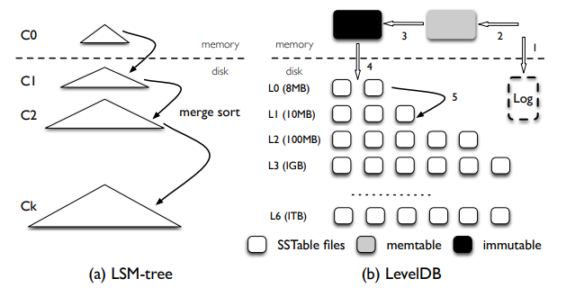
> Figure 1: **LSM树和LevelDB架构。** 这张图片标准LSM树和LevelDB的架构。对于LevelDB来说，插入一个键值对需要经历许多步骤：(1) 日志文件 (2) memtable (3) inmmutable memtable (4) *L0* 的SSTable (5) 压缩至更深的层级

在LSM树的插入中，被插入的键值对被追加到磁盘上的顺序日志文件中，以便在发生崩溃时能够恢复。然后，该键值对被添加到内存中的C0，C0时按key排序的。C0允许对最近插入的键值对进行高效查找和扫描。一旦C0到达了其大小的限制就会与磁盘上的C1合并，方法类似于归并排序，这个过程被称为*compaction*。新合并的树会被顺序地写入磁盘，替换C1的旧版本。每当Ci到达了其大小的限制，compaction(i.e.., 归并排序)也会发生在磁盘的组件之间。值得注意的是，compaction只会发生在相邻层级(Ci和Ci+1)，他们可以在后台异步执行。

为了支持查找操作，LSM树需要搜索多个组件。值得注意的是，C0包含最新的数据，紧接着是C1，以此类推。因此，为了检索一个键值对，LSM树以级联的方式从C0开始搜索组件，知道它在最小的组件Ci中找到所需的数据。对于单点查找，与B树相比，LSM树可能需要读取多次。因此对于插入比查找更频繁时，LSM树是最有用的。

#### 2.2 LevelDB
LevelDB是一个广泛使用的LSM树键值存储，它受BigTable启发。LevelDB支持范围查询，快照以及在现代应用中十分有用的特点。在本节，我们简要地介绍LevelDB的核心设计。

LevelDB的整体架构如图1所示。LevelDB中的主要数据结构是磁盘上的日志文件，两个内存中的有序跳表(*memtable*和*immutable memtable*)，和七个层级(*L0*到*L6*)的磁盘有序字符串表(*SSTable*)文件。LevelDB最开始将被插入的键值对存储在一个日志文件和内存中的*memtable*。一旦memtable满了，LevelDB会切换到一个新的memtable和日志文件来处理之后的用户插入。在后台，先前的memtable会编程immutable memtable，并且一个compaction线程会将它刷新到磁盘上，在第0层(*L0*)生成一个新的SSTable文件(通常大约2MB)，先前的日志文件被抛弃。

每层中所有文件的总大小是有限制的，并随着层级数的增加而增加十倍。例如，*L1*所有文件的总大小限制为10MB，而*L2*的限制为100MB。为了维持大小限制，一旦*Li*层的总大小超过了该层的限制，compaction线程就会从*Li*选择一个文件与*Li+1*层所有重叠的文件机进行归并排序，然后生成新的*Li+1*层SSTable文件。Compaction线程会持续运行直到所有层级的大小都在限制之内。同样，在compaction过程中，LevelDB会确保所有的文件都位于特定的层级，除了*L0*层，其他层的key范围都不会存在重叠。*L0*层文件中的key会与其它文件存在重叠，因为它们都是由memtable直接刷新到磁盘上的。

查找过程如下，LevelDB首先搜索memtable，然后是immutable memtable，再然后按序搜索*L0*层到*L6*层。找到一个随机key所需的文件查找次数由最大层级数决定，因为*L0*层会存在重复的key，一次查找可能会查找*L0*层的多个文件。为了避免过高的查找延迟，如果*L0*层的文件数量大于8个，LevelDB会减慢前台的写流量，以等待压缩线程将一些文件从*L0*层压缩到*L1*层。

#### 2.3 写放大和读放大
写放大和读放大是像LevelDB这样的LSM树的主要问题。写(读)放大被定义为写入(读取)底层存储设备的数据量与用户要求的数据量之间的比率。在本节，我们会分析LevelDB中的写放大和读放大。

为了最大化磁盘的顺序访问，LevelDB写入的数据比必要得多(尽管仍然是按顺序写)，换句话说，LevelDB存在很高的写放大。因为*Li*层的大小限制是*Li-1*层的10倍，在compaction过程中，当将一个文件从*Li-1*层合并到*Li*层的时，LevelDB在最坏情况下可能会读取*Li*层的10个文件，并在排序后将这些文件写回*Li*层。因此，在两层之间移动一个文件的写放大最大可以为10。对于一个很大的数据集，因为任何新产生的表文件都可以通过一系列压缩步骤最终从*L0*层迁移到*L6*层，写放大可以超过50(*L1*到*L6*之间每层相差10倍)

由于在设计中的权衡，读放大一直是LSM树的一个主要问题。在LevelDB中存在两种读放大。首先，为了读取一个键值对，LevelDb可能需要检查多个层级。最坏情况下，LevelDB需要检查*L0*的八个文件，以及其余6个层级中的每个层级的一个文件：总共14个文件。其次，为了在SSTable文件中查找一个键值对，LevelDB需要读取文件中的多个元数据块。具体来说，实际读取的数据量是由(index block + bloom-filter blocks + data block)决定的。例如，为了查找一个1KB的键值对，LevelDB需要读取一个16KB的index block，一个4KB的bloom-filter block和一个4KB的data block，总共24KB。因此，考虑到最坏情况需要最多需要读取14个SSTable文件，LevelDB的读放大是24 × 14 = 336。更小的键值对会导致更高的读放大。

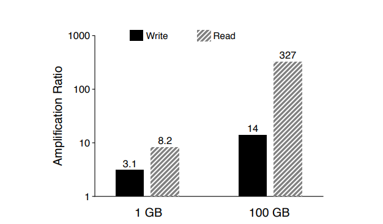
> Figure 2: **写放大和读放大**。这张图片展示了LevelDB在1GB和100GB两种不同数据库规模下的写放大和读放大，key大小为16B，value大小为1KB。

为了测量LevelDB在实践中的放大，我们进行了以下实验。我们首先加载一个有1KB键值对的数据库，然后从数据库查找100000个条目，我们使用两种不同的数据库大小作为初始加载，并且从一个正态分布中随机选择key。Figure 2展示了在加载过程中的写放大以及在查找过程中的读放大。对于一个1GB的数据库，写放大为3.1，然而对于一个100GB的数据库，写放大增长到了14。读放大也有着同样的趋势：对于1GB的数据库，读放大为8.2，而对于100GB的数据库，读放大则是327。写放大随着数据库的大小而增加的原因是很明显的。随着更多的数据被插入到数据库中，键值对更有可能遍历到更深的层级，换句话说，LevelDB在从低层级压缩到高层级时会多次写入数据。然而写放大并没有达到之前预测的最坏情况，因为更层级之间合并的文件平均数了通常小于最坏情况的10个。读放大同样随着数据集的大小而增大，因为对于一个小数据库来说，SSTable文件中所有的index block和布隆过滤器会被缓存在内存中。然而，对于一个大型数据库来说，每次查找都可能触及不同的SSTable文件，每次都要造成读取index block和布隆过滤器的开销。

应该注意的是，对于硬盘来说读写放大过高是一种合理的权衡。例如，对于一个10ms寻道延迟和100MB/s吞吐量的硬盘，访问随机的1K数据所需的大致时间是10ms，而下一个顺序块的延迟约为10µs—随机和顺序延迟的比为1000：1。因此，相较于可选的数据结构，例如需要随机写入访问的B树，写放大倍数小于1000的纯顺序写的方案在硬盘上会更快。另一方面来说，LSM树的读放大仍与B树相当。例如，考虑一个高度为5，并且块大小为4KB的B树，一次随机查找1KB键值对可能需要访问访问六个块，造成24倍的读放大。

#### 2. 4 高速存储硬件
许多现代服务器采用SSD设备来实现高性能。与硬盘类似，由于固态硬盘独特的擦写周期和昂贵的垃圾回收，随机写入也被认为是有害的。虽然固态硬盘设备的初始随机写入性能很好，但在保留快被利用后，性能会明显下降。因此，LSM树避免随机写入的特性天然适用于SSD，许多针对SSD优化的键值存储都是基于LSM树。

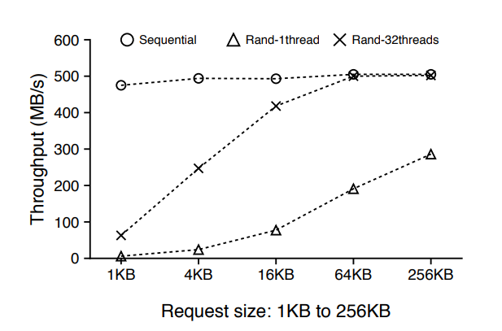
> Figure 3: SSD上的顺序和随机读取。这张图片展示了现代SSD在不同请求下的顺序读取和随机读取性能。

然而，与硬盘不同的是，随机读取性能（与顺序读取相比）在固态硬盘上明显更好。除此之外，当随机读取在固态硬盘中同时发出时，对于某些工作负载来说，总吞吐量可以与顺序读取吞吐量相媲美。例如，Figure 3展示了在500GB的三星840EVO固态硬盘上的顺序和随机读取不同需求大小的性能。对于单线程的随机读取，吞吐量随着所需大小而增长，达到了256KB的了顺序读取吞吐量的一半。在32个线程并发随机读取的情况下，当大小超过16KB时，总吞吐量与顺序吞吐量相符。对于更高端的固态硬盘，并发的随机读取和顺序读取之间的差别要小很多。

正如我们在这节所展示的，LSM树有很高的读写放大，这对于硬盘来说是可以接收的。在一个高性能的固态硬盘上使用LSM树可能会因为过度的写入和读取而浪费很大比例的设备带宽。在这份论文中，我们的目标时提高LSM树在SSD设备上的性能，以有效利用设备带宽。

### WiscKey

先前的章节解释了LSM树如何如何通过增加I/O放大来维持顺序I/O访问。然而这种在顺序I/O访问和I/O放大之间的权衡对于硬盘是适用的，但是对于使用固态硬盘的现代硬件来说并不是最佳选择。在本节，我们提出了WiscKey的涉及，一个可以最大限度地减少SSD上I/O放大地键值存储。

为了实现针对SSD优化地键值存储，WIscKey包含四个关键的概念。首先，WiscKey将key和value分离，只有key才保存在LSM树中而value保存在一个单独的日志文件。第二，为了处理非有序的value(在范围查询时需要随机访问)，WiscKey使用了固态硬盘设备的并行随机读取特性。第三，WiscKey利用独特的崩溃一致性和垃圾收集技术来有效地管理日志。最后，在不牺牲一致性地情况下，WiscKey通过删除LSM树日志来优化性能从而减少小型写入地系统调用开销。

#### 3.1 设计目标
WiscKey是一个单机地持久化键值存储，它源于LevelDB。它可以作为一个存储引擎部署在关系型数据库(如MySQL)或分布式键值存储(如MongoDB)上。它提供了像LevelDB一样的API，包括Put(key, value)，Get(key), Delete(key)和Scan(start, end)。WiscKey的涉及遵循这些主要目标。

**低写放大**。写放大引入了额外的不必要的写入。即使固态硬盘设备与硬盘相比具有更高的带宽，很高的写放大会浪费大多数写带宽(超过90％的情况并不罕见)并由于有限的擦除周期而减少固态硬盘的使用寿命。因此，最大限度地减少写放大以提高工作负载性能和固态硬盘地寿命是非常重要的。

**低读放大**。高读放大会导致两个问题。首先，为每个查找发出多个读取会显著降低查找地吞吐量。其次，大量地数据加载到内存中会降低缓存的效率。WiscKey的目标是以用一个较小的读放大来加速查找。

**针对SSD优化**。WiscKey通过用SSD设备的性能特性匹配其I/O模式来优化SSD设备。具体来说，有效利用顺序写入和并行随机读取来让应用程序充分利用设备带宽。

**丰富的API**。WiscKey旨在提供能让LSM树流行的现代特点，比如范围查找和快照。范围查找允许扫描一段连续的键值对。快照允许捕获数据库在某一特定时间的状态，然后对该状态进行查询。

**现实的键值大小**。键在现代工作负载通常都很小(例如16B)，而value区别很大(例如100B到大于4KB)。WiscKey旨在为真实的简直大小提供更高的性能。

#### 3.2 键值分离
LSM树的主要性能开销是compaction过程，它会定期的排序SSTable文件。 在compaction时，多个文件被读进内存，排序，然后写回，这会显著影响前台的工作负载的性能。然而，排序是为了高效地检索，通过排序，范围查询(即扫描)将主要导致对多个文件的顺序访问，而单点查询则需要在每一层级最多访问一个文件。

WiscKey的动机是一个简单的启示。Compaction仅需要排序key，而value可以被单独管理。因为key通常小于value，在排序时只压缩key可以显著减少所需数据。在WiscKey中，只有value的地址才会和key一起存储在LSM树，而真实的value以一种SSD友好的方式存储在其它地方。通过这种设计，对于一个给定大小的数据库，WiscKey的LSM树大小比LevelDB的更小。较小的LSM树可以显著减少拥有适度value大小现代工作负载的写放大。例如，假设有一个16B的key，一个1KB的value，并且key的写放大(在LSM树中)为10，value的写放大为1，WIscKey的有效写放大只有(10 × 16 + 1024) / (16 + 1024) = 1.14。除了提升应用的写性能，减少的写放大统也通过更少的擦除周期提升了固态硬盘的使用寿命。

WiscKey较小的读放大提升了查找性能。在查找时，WiscKey首先查找LSM树中的key和value的地址，一旦找到了，会发出另一个对于value读取。读者可能会认为，WiscKey的查找速度会比LevelDB慢，因为检索value会产生额外的I/O。然而，因为WiscKey的LSM树比LevelDB小得多(对于同样的数据库大小)，在LSM树中一次查找会搜索更少的层级的SSTable文件，而且LSM树的很大一部分可以很轻易地缓存在内存中。因此，每次查找仅需要一次简单地随机读取(针对检索value)，并且性能要好于LevelDB。例如，假设有16B地key和1KB的value，如果整个键值数据集的大小为100GB，那么LSM树的大小仅仅约2GB(假设一个value地址和大小的开销为12B)，这可以轻易缓存在具有超过100GB内存的现代服务器中。

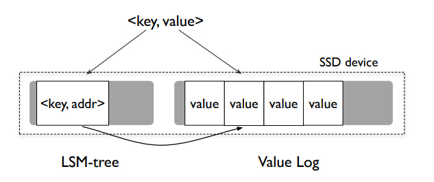
> Figure 4: **WiscKey在SSD上的数据布局**。这张图片显示了WiscKey在SSD上的数据布局。Key和value的位置存储在LSM树中，而value则追加到一个单独的日志文件。

WiscKey的架构如Figure 4所示。key存储在LSM树中而value存储在一个单独的value-log文件，称为*vLog*。和key一起存储在LSM树中的假value时vLog中真实value的地址。

当用户在WiscKey中插入一个键值对，value首先会被追加到vLog，然后key会和value的地址(<vLog-offset, value-size>)一起被插入到LSM树中。删除一个key秩序简单地从LSM树中删除，不需要涉及vLog。vLog中所有有效的value都在LSM树中存在对应的key，vLog中其它的value都是无效的并且会在之后被当作垃圾回收。

当用户查询一个key时，首先会搜索LSM树，如果找到了，那么对应value的地址也找到了。然后，WiscKey会在vLog中读取value。值得注意的是，这个过程对于单点查询和范围查询都适用。

虽然键值分离的想法很简单，但它也带来了许多挑战和优化机会，这会在下面的小节中描述。

#### 3.3 挑战
键值分离使得范围查询需要随机I/O。除此之外，键值分离同样使得垃圾回收和崩溃一致性成为挑战。我们现在介绍如何解决这些困难。

##### 3.3.1 并行范围查询
范围查询是现代键值存储的一项重要特性，它允许用户扫描一个范围内的键值对。关系型数据库，本地文件系统，甚至是分布式文件系统都使用键值存储作为存储引擎，而范围查询是这些环境所需的核心API。

对于范围查询，LevelDB为用户提供了一个基于迭代器的接口，有Seek(key)，Next()，Prev()，Key() 和 Value()操作。为了扫描一个范围内的键值对，用户首先调用Seek()找到起始的key，然后调用Next()或者Prev()来逐一搜索key。为了检索当前迭代器位置的key或者value，用户分别调用Key()或Value()。

在LevelDB中，因为key和value是一起存储并且排序的，一次范围查询可以从SSTable文件中顺序地读取键值对。然而，在WiscKey中，key和value是分开存储的，范围查询需要随机读取，因此并不高效。正如Figure 3所看到的，SSD中单个线程的随机读取性能无法与顺序读取性能媲美。然而，具有相当大的请求规模的并行随机读取可以充分利用设备的内部并行性，获得与顺序读取类似的性能。

为了使得范围查询高效，在范围查询时，WIscKey利用SSD设备的并行I/O特性来预取vLOg中的value，其基本的思想是，有了SSD设备，只有key需要高效检索。只要高效地检索到了key，范围查询就能使用并行随机读取来高效地检索value。

预取框架可以轻易地适配当前范围查询接口。在当前的接口中，如果用户请求一次范围查询，那么会接收一个迭代器。对于迭代器上的每次Next()或者Prev()，WiscKey追踪范围查询的访问模式。一旦请求一个连续的键值对序列，WiscKey就开始从LSM树依次地读取这些key。从LSM树上读取到的对应地value地址会被插入到一个队列，多个线程会在后台从vLog并发的拿到这些地址。

##### 3.3.2 垃圾回收
在基于标准LSM树地键值存储中，当一个键值对被删除或者覆盖时，LSM树并不会立即回收自由空间。相反，在compaction时，如果一个已经被删除或者覆盖的键值对数据被找到了，那么数据就会被抛弃并且空间被回收。在WiscKey中，只有无效的key才会在compaction过程中回收。因为WiscKey并不会压缩value，它需要一个特殊的垃圾收集器来回收vLog中的自由空间。

因为我们仅在vLog文件中存储value，一种简单的方式从vLog回收自由空间是，首先扫描LSM树拿到所有的无效的value地址，然后，vLog种所有没有被LSM树有效引用的value都可以看做是无效的并被回收。然而，这种方法太笨重并且仅仅对离线垃圾收集有用。

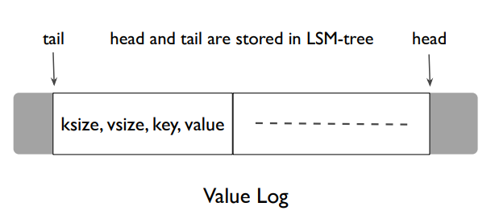
> Figure5: WiscKey针对垃圾回收的新数据布局。这张图片展示了支持高效垃圾回收的WiscKey的新数据布局。在内存中，会维护一个头部指针和尾部指针并持久化到LSM树中。只有垃圾回收会改变尾部，而所有写入都追加到头部。

WiscKey的目标是减小重量并且支持在线垃圾收集。为了实现这一目标，我们对WiscKey的基本数据布局引进了小小的改变：当存储value到vLog中时，我们同样存储和value对应的key。新的数据布局如Figure 5所示：vLog中存储的是元组(key size, value size, key. value)。

WiscKey的垃圾收集旨在将有效的value(不对应于被删除的key)保留在vLog的连续范围内。这个范围的一端，称为*head*，总是对应vLog中新的value被追加的一端，而范围的另一端，称为*tail*，是触发垃圾回收时开始释放空间的地方。只有vLog中头部和尾部之间的部分包含有效的value并且会在查找时被搜索。

在垃圾收集时，WiscKey首先会从vLog尾部读取一大块键值对(例如，几MB)，然后通过查询LSM树查找哪些value(还没有被覆盖或者删除)是有效的。WiscKey然后追加有效的value到vLog的头部。最后它会释放先前被块占用的空间，并且连带更新尾部。

为了避免在垃圾收集时发生崩溃而丢失数据，WiscKey必须保证新追加的有效的value和新的尾部在真正回收空间时已经持久化到设备。WiscKey按以下步骤实现了这个目标。在追加有效的value到vLog后，垃圾收集对vLog调用fsync()。然后，它以同步的方式向LSM树添加这些新的value的地址和当前的尾部。尾部按<"tail", tail-vLog-offset>存储在LSM树种。最后，子vLog的自由空间就会被回收。

WiscKey可以被配置为定期启动并持续地进行垃圾回收直到达到一个特定的阈值。少量删除的工作负载和超大存储空间的环境几乎不会触发垃圾收集。

##### 3.3.3 崩溃一致性
在系统崩溃时，LSM树的实现通常保证已经插入的键值对的原子性并按序恢复已经插入的键值对。因为WiscKey的架构将value与LSM树分开存储，要获得同样的崩溃保证可能会显得很复杂。然而，WiscKey通过使用现代文件系统(比如ext4，btrfs和xfs)一项有趣的属性提供了同样的崩溃保证。考虑一个包含字节序列*<b1b2b3...bn>*的文件，并且用户向文件追加序列*<bn+1bn+2bn+3...bn+m>*。如果发生了崩溃，在现代文件系统的恢复后，可以观察到文件包含字节序列*<b1b2b3...bnbn+1bn+2bn+3...bn+x> ∃ ＜x*, 即在文件系统恢复时，只有追加的字符的一些前缀会添加到文件的末尾。对于随机的字节或者追加字节的非前缀子集是不会被添加到文件的。因为value在WiscKey种是被顺序地追加到vLog文件的末尾，先前提到的属性可以简单地转换成：如果vLog的value *X*在崩溃中丢失了，那么所有后来的value(在*X*后插入)同样丢失了。

当用户查询一个键值对时，如果key在系统崩溃时丢失了，如果WiscKey因为key在系统崩溃中丢失了而无法在LSM树中找到，WiscKey会像传统LSM树一样工作：即使value在崩溃前已经被写入vLog，它也会在之后被垃圾回收。然而，如果在LSM树中能找到key，则需要额外的步骤来保持一致性。在这种情况下，WIscKey首先会验证从LSM树检索到的value地址是否在vLog当前的有效范围内，并且找到的value是否对应待查询的key。如果验证失败，WiscKey则认为value在系统崩溃中丢失了，从LSM树中删除key，并且通知用户key不存在。因为每个添加到vLog中的value有一个头部，头部中记录着对应的key，可以验证key和value是否直接匹配。如果有必要，也可以简单地添加一个魔数或者校验和到头部。

如果用户指定请求同步插入，LSM树统一保证了在系统崩溃后键值对的持久性。WiscKey是通过在执行同步插入到LSM树之前刷新vLog到磁盘来实现同步插入的。

#### 3.4 优化
WiscKey中的键值提供了一个很好的角度，重新思考如何更新value日志和LSM树日志的必要性。我们现在描述下这些机会如何改善性能。

##### 3.4.1 Value-Log 写缓冲
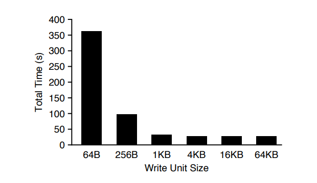
> Figure 6: **写大小的影响**。这张图片展示了在SSD设备上写入10GB文件到*ext4*文件系统并在最后调用*fsync()*的总耗时。每个系统调用的大小都不相同。

对于每次Put()，WiscKey需要使用一次write()系统调用向vLog追加value。然而，对于插入密集型的工作负载，向文件系统发出一次超大数目的小写入可能会引入很大的开销，特别是在高速存储设备上。Figure 6展示了在ext4(Linux3.14)上顺序写入一个10GB文件的总耗时。对于小写入来说，每个系统调用的开销都会大大增加，从而导致超长的运行时间。在大写入(大于4KB)情况下，设备的带宽能得以完全利用。

为了减少开销，WiscKey在一个用户态的buffer中缓冲value，并只在缓冲大小超过限制或者用户请求同步写入时才刷新缓冲到磁盘上。因此，WiscKey只发出大的写入，并减少write()系统调用的数量。对于查找，WiscKey首先查找vLog的缓冲区，如果找不到，才会真正地从vLog读取。显然，这种机制可能会导致一些数据(被缓冲的)在崩溃时会发生丢失，所能保证的崩溃一致性类似于LevelDB。

##### 3.4.2 优化LSM树日志
正如Figure 1所示，日志文件通常用于LSM树中。LSM树会追踪日志文件中插入的键值对，这样如果用户请求同步插入时并发生了崩溃，日志会在重启后扫描并恢复已插入的键值对。

在WiscKey中，LSM树仅用于key和value地址。更进一步来说，vLog只记录已经插入的key以支持前几节所描述的垃圾回收。因此，在不影响正确性的情况下，可以避免LSM树日志文件的写入。

如果在LSM树中的key在持久化之前发生了崩溃，可以通过扫描vLog来恢复它们。然而，恢复的简单算法需要扫描整个vLog。所以为了只需扫描vLog的一小部分，WiscKey定期地在LSM树以键值对<"head", head-vLog-offset>的格式记录vLog的头部。当数据库打开时，WsicKey开始从存储在LSM树中最近的头部位置扫描vLog，并持续到vLog的末尾。因为头部存储在LSM树中，因而LSM树简介保证了插入到LSM树中的key会按插入时的顺序恢复，这种优化可以满足崩溃一致性。因此，移除WiscKey中LSM树的日志是一个安全的优化，并在存在许多小的插入时显著地提高了性能。

#### 3.5 实现
WiscKey是基于LevelDB 1.18版本。WiscKey在创建一个新的数据库时会创建vLog，并在LSM树种管理key和value地址。vLog通过多个组件以不同的访问模式访问内部。例如，通过随机读取vLog来提供查询，而垃圾收集器顺序地从读取vLog文件的尾部并追加到头部。我们使用posix_fadvise()来在不同的情况下提前声明vLog的访问模式。

对于范围查询，WiscKey维护一个具有32个线程的线程池。这些线程在一个线程安全的队列上睡眠，等待新的value地址的到达。当预取被触发，WiscKey插入固定数量的value地址到工作队列，并唤醒所有的睡眠线程。这些线程会并行地开始读取value，原子地在缓冲缓存种缓存它们。

为了高效地垃圾收集vLog种的自由空间，我们使用现代文件系统的打洞功能(fallocate())。在文件中打动可以释放已分配的物理空间，并允许WiscKey静态地使用存储空间。现代文件系统的最大文件大小足以让WiscKey运行很长时间而不用返回到文件的开头。例如，在ext4上最大的文件大小是64TB，在xfs上是8EB，而btrfs上是16EB。如果有必要的话，vLog可以被简单地改编成一个循环日志。

### 4 评估
在本小节中，我们提供了评估结果，展示了采用WiscKey设计选择的优势。

所有实验都运行在具有2片Intel(R) Xeon(R) CPU E5-2667 v2 @ 3.30GHz处理器和64GB内存的测试机器上。操作系统是64位Linux 3.14，所使用的文件系统为ext4，所使用的存储设备为500GB的Samsung 840 EVO SSD，它具有最大500MB/s的顺序读性能和最大400MB/s的顺序写性能。随机读取性能如Figure 3所示。

#### 4.1 Microbenchmarks
我们使用db_bench(LevelDB中默认的microbenchmarks)来评估LevelDB和WiscKey。我们总是使用大小为16B的key，而对不同大小的value进行实验。我们禁用了数据压缩以更好的理解和进行实验分析。

##### 4.1.1 加载性能
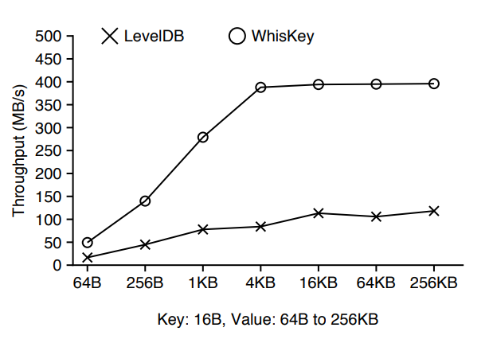
> Figure 7: **顺序加载性能**。这张图片显示了LevelDB和WiscKey在不同大小value的100GB数据库中的顺序加载吞吐量。Key大小为16B。

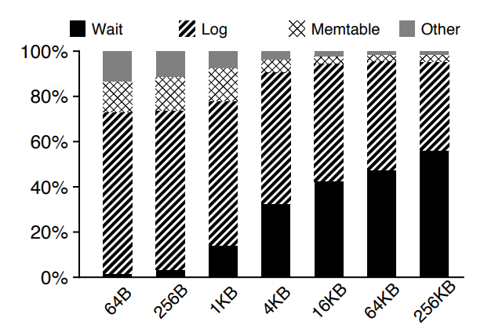
> Figure 8: **LevelDB顺序加载时间分布图**。这张图片显示了在LevelDB的顺序加载过程中不同参数所产生的时间百分比。

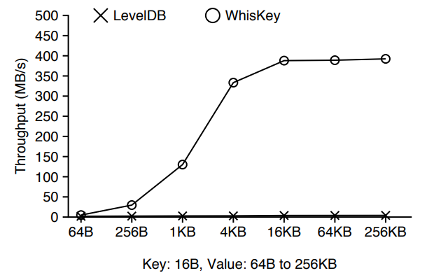
> Figure 9: **随机加载性能**。这张图片显示了LevelDB和WiscKey在不同大小value的100GB数据库中的随机加载吞吐量。Key大小为16B。

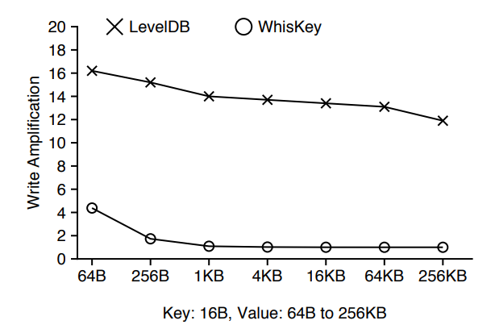
> Figure 10: **随机加载的写放大**。这张图片显示了LevelDB和WiscKe随机加载100GB数据库时造成的写放大。

我们现在描述顺序加载和随机加载microbenchmarks的结果。前者benchmark通过顺序插入许多key构造了一个100GB的数据库，而后者以正态分布随机顺序插入key。值得注意的是，顺序加载benchmark都没有导致LevelDB和WiscKey造成compaction，而随机加载触发了。

Figure 7展示了对于一系列大小的value，LevelDB和WiscKey的顺序加载吞吐量：两者存储的吞吐量都随着key的大小而增加。然而，即使是考虑到最大的value的大小(256KB)，LevelDB的吞吐量也远远低于设备的带宽。为了进一步分析这种现象，Figure 8展示了在在不同的组件下，LevelDB每一次运行benchmark的耗时分布，时间主要耗费在三个部分：写入日志文件，插入到memtable中，以及等待memtable刷新到设备上。对于小的键值对，写入到日志文件占总时间的百分比最大，原因在Figure 6中解释了。对于较大的键值对，日志写入和memtable的排序是十分高效的，然而memtable的刷新落盘成了系统的瓶颈。与LevelDB不同的是，WiscKey对于大小超过4KB的value到达了最大的设备带宽。因为它并没有写入LSM树日志而是将缓冲区追加到vLog，即使是较小的value，它也快了3倍。

Figure 9展示了在不同大小的value下，LevelDB和WiscKey的随即加载吞吐率。LevelDB的吞吐量。LevelDB的吞吐率为2MB/s(64B大小的value)到4.1MB/s(256KB大小的value)，而WiscKey的吞吐率随着value的大小而增长，在value大小大于4KB后，吞吐率达到了设备的峰值。对于1KB大小的value，WIscKey的吞吐率是LevelDB的46倍，而对于4KB大小的value，WIscKey的吞吐率是LevelDB的111倍。LevelDB的吞吐率较低是因为compaction不仅占用了大部分的设备带宽，而且还降低了前台的写入(为了避免LSM树*L0*层级的过载，正如2.2节所说描述的)。在WiscKey中，comapction只会引入较小的开销，但这样可以使得设备的带宽完全利用。为了进一步分析这种情况，Figure 10展示了LevelDB和WiscKey的写放大。LevelDB的写放大总是超过12，而WiscKey的写放大在value大小到达1KB的时候迅速降低为1左右，因为WiscKey的LSM树更小。

##### 4.1.2 查询性能
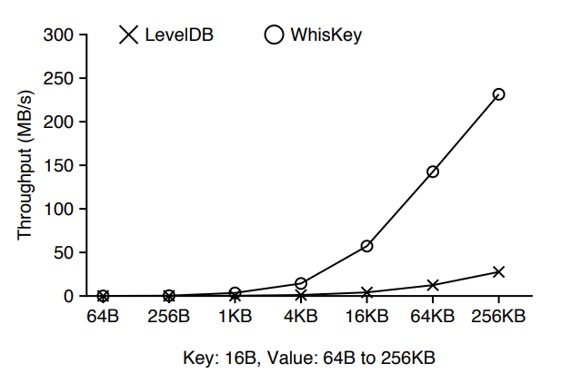
> Figure 11: **随机查找性能**。这张图片显示了LevelDB和WiscKey在随机加载的100GB数据库上进行100000次随即查找操作的性能。

我们现在比较LevelDB和WiscKey的随即查询(单点查询)和范围查询性能。Figure 11 展示了在一个100GB大小的、随机加载加载的数据库上进行100000次随即查找操作的结果。在WIscKey中，即使随机查找需要同时检查LSM树和vLog，WIscKey的吞吐率仍然比LevelDB更好：对于1KB大小的value，WiscKey的吞吐率是LevelDB的12倍。对于较大大小的value。WiscKey的吞吐率受限于设备的随机读取吞吐率，正如Figure 3所示。因为LevelDB具有2.3节所述的超高读放大，所以具有较低的吞吐率。由于WIscKey具有一个更小的LSM树，读放大耕更低，所以性能明显更好。WiscKey具有更好的性能的另一个原因是compaction的频率更低，因此避免了许多后台的读取和写入。

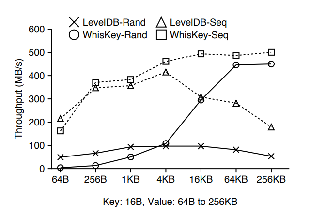
> Figure 12: **范围查询性能**。这张图片显示了LevelDB和WiscKey分别从随机加载(Rand)和顺序加载(Seq)的100GB数据库中范围查询4GB数据的性能。

Figure 12 展示了LevelDB和WiscKey的范围查询(扫描)性能。对于一个随机加载的数据库，LevelDB从不同的层级读取多个文件，而WiscKey需要随机访问vLog(但是WiscKey充分利用并行随机读取)。正如Figure 12所看到的，LevelDB的吞吐率最初随着数据库value大小而提高。然而，在value大小超过4KB后，因为SSTable文件只能存储少量的键值对，开销的大头主要是打开许多SSTable文件并读取每一个文件的索引块和布隆过滤器。对于更大的键值对，WiscKey可以提供设备的顺序贷款，最高可达到LevelDB的8.4倍。然而，对于比较小的请求大小，因为设备有限的并行随机读取吞吐率，WiscKey在64B大小的键值对上的表现比LevelDB差12倍。WIscKey在具有更高并行的随机读取吞吐率的高端SSD设备上相对性能更好。除此之外，这个工作负载代表了最坏的情况，数据库是随机填满的并且vLog中的数据是无序的。

Figure 12也展示了当数据是有序情况下的范围查询性能，它对应了一个顺序加载的数据库。在这种情况下，LevelDB和WiscKey可以顺序地扫描数据。对于顺序加载地数据库来说，其性能和随即加载数据库有着同样的趋势，对于64B大小地键值对，WiscKey比LevelDB慢25％，因为WiscKey同时从vLog中读取key和value(因此浪费了带宽)，但是对于更大大小的键值对，WiscKey比LevelDB快2.8倍。因此，对于较小大小的键值对的随机加载数据库，重新组织(排序)日志可以使得WiscKey的范围查询性能与LevelDB相当。

##### 4.1.3 垃圾回收
我们现在调探讨当垃圾收集器在后台工作时WiscKey的性能表现。性能可能有所不同，取决于在垃圾收集期间发现的自由空间的占比，因为这会数据的写入量和垃圾回收线程释放的空间大小。我们使用随即加载(对垃圾回收影响最大的工作负载)作为后台的工作负载，并研究对于不同自由空间大小的性能。我们的实验具体涉及了三个步骤：我们首先使用随机加载创建一个数据库，然后删除了要求比例的键值对，并测量了当后台发生了垃圾回收时的吞吐率。我们使用4KB大小的键值对而自由空间的比例由25％到100％。

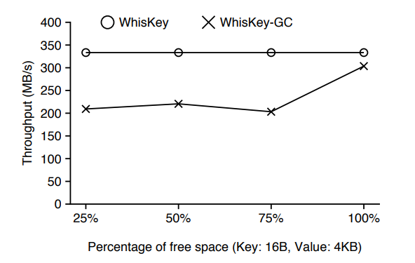
> Figure 13: **垃圾收集**。这张图片显示了WiscKey在不同自由空间比例的垃圾收集性能。

Figure 13展示了结果：如果垃圾收集器读取到的全部数据都是无效的，那么吞吐率只减少10％。吞吐率只是稍微减少是因为垃圾收集从vLog的尾部读取并只写入有效的键值对到头部。如果所读取到的数据是完全无效的，没有任何键值对需要写入。对于其它比例的自由空间，吞吐率下降了35％因为垃圾收集现场需要执行额外写入。值得注意的是，在所有的情况中，当垃圾收集发生时，WiscKey至少比LevelDB快70倍。

##### 4.1.4 崩溃一致性
键值分离必然需要额外的机制来维持崩溃一致性。我们使用ALICE工具来识别崩溃一致性机制。工具选择并模拟一系列拥有很高比例暴露非一致性的系统崩溃。我们使用涉及少量异步和同步的Put()调用的测试用例。当配置成在ext4, xfs和btrfs上运行测试时，ALICE会检查超过3000个独所选的系统崩溃，并不会通知任何由WiscKey所引起的一致性漏洞。

新的一致性机制也会影响WiscKey在崩溃后的恢复时间，我们设计了一个实验来测量WiscKey和LevelDb在最坏情况下的恢复时间。LevelDB的恢复时间与崩溃后其日志文件的大小成正比。在memtable被写入磁盘前，日志文件大小存在性最大值。在恢复期间，WiscKey首先检索LSM树中的头部指针，然后从头部指针直到文件末尾扫描vLog文件。因为最新的头部指针在memtable被写入时已经被持久化到磁盘上，所以WiscKey的最坏情况下的恢复时间也对应于在此之前发生的崩溃时间。我们测量了到目前为止所描述的情况下所引起的最坏情况下的恢复时间。对于1KB大小的value，LevelDB在崩溃后需要花费0.7s来恢复数据库，而WiscKey需要花费2.6s。值得注意的是，如果有必要的话，WiscKey可以配置成更加频繁地持久化头部指针。

##### 4.1.5 空间放大
当评估一个键值存储时，先前大部分的工作都仅将目光聚焦在读放大和写放大。然而，对于闪存设备来说，空间放大也是不可忽视的一部分，因为它们相对于硬盘的昂贵空间价格。空间放大是磁盘上数据库的实际大小与数据库逻辑大小的比值。例如，如果一个1KB的键值对需要占用磁盘4KB的空间，那么空间放大为4。压缩可以减少空间放大而额外的数据(垃圾，碎片或元数据)会增加空间放大。为了让讨论简单，压缩是没有开启的。

对于顺序加载的工作负载，考虑到LSM树中额外的元数据很少，空间放大会接近1。对于随机加载或覆盖的工作负载，当无效的键值对没有及时地被垃圾回收时，空间放大通常超过1。

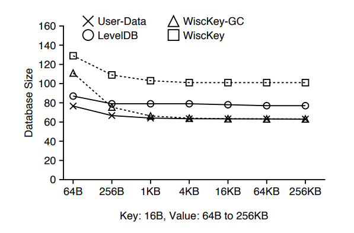
> Figure 14: **空间放大**。这张图片显示了LevelDB和WiscKey随机加载100GB数据集的实际数据库大小。User-Data代表逻辑数据库大小。

Figure 14 展示了在随机地加载一个100GB地数据集后(和Figure 9一样的工作负载)LevelDB和WiscKey的数据库大小。LevelDB的空间开销是由于无效的键值对引起的，因为这些无效的键值对在工作负载结束后没有被垃圾回收。WiscKey的空间开销包括无效的键值对和额外的元数据(LSM树种的指着内核如Figure 5所展示的vLog中的元组)。在垃圾回收后，此时额外的元数据与value大小相比很小，WIscKey的数据库大小接近于逻辑数据库的大小。

没有任何一个键值存储可以同时最小化读放大，写放大和空间放大。这三者的权衡在不同的系统中平衡不同。在LevelDB中，排序和垃圾回收是捆绑在一起的。LevelDB以更高写放大为代价换取更低的空间放大。但是，工作负载性能会因此受到很大影响。当运行工作负载时，WiscKey花费更多的空间来最小化I/O放大，这是因为在WiscKey中，排序和垃圾回收解耦的，垃圾回收可以之后在完成，因此得以最小化对前台性能的影响。

##### 4.1.6 CPU使用率
我们现在探讨在先前小节所展示的不同工作负载情况下LevelDB和WiscKey的CPU使用率。此处所述的CPU使用率同时包括应用和操作系统的使用。

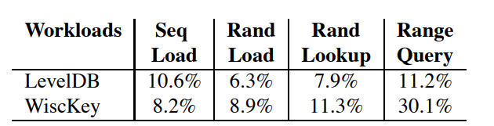
> Table 1: **LevelDB和WiscKey的CPU使用率**。这张图标比较了LevelDB和WiscKey在四个不同工作负载下的CPU使用率。Key的大小为16B和value的大小为1KB。Seq Load和Rand-Load分别顺序地和随机地加载100GB的数据库。给定一个随机填满的100GB数据库，Rand-Lookup发射100K随即查找，而Range-Query顺序地扫描4GB数据。

如Table 1所示，对于顺序加载的工作负载，LevelDB拥有更高的CPU使用率。正如我们在Figure 8所解释的，LevelDB花费了大量的时间来将键值对写入到到日志文件。写入日志文件涉及到编码每一个键值对，需要很高的CPU开销。因为WiscKey移除了日志文件作为优化，WiscKey比LevelDB拥有更低的CPU使用率。对于范围查询工作负载，WiscKey使用了32个后台线程来执行预取工作，因此，WiscKey的CPU使用率要比LevelDB更高。

在我们的设置中，我们发现CPU并不是LevelDB和WiscKey的瓶颈。LevelDB的架构是基于单线程写协议。后台compaction也只会使用一个线程。RocksDB中探索了更好的多核并发设计。

#### 4.2 YCSB Benchmarks
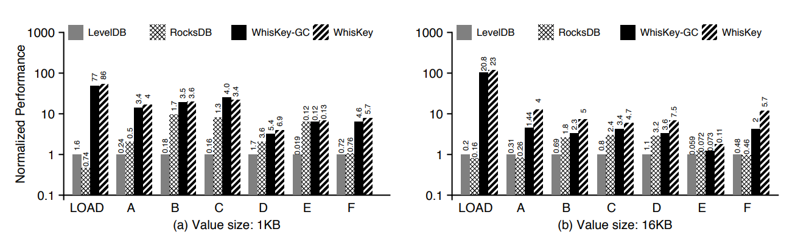
> Figure 15: **YCSB Macrobenchmark 性能**。这张图片展示了LevelDB、RocksDB和WiscKey在不同YCSB工作负载下的性能。X轴对应不同的工作负载，Y轴展示了相对于LevelDB的归一化性能。每个柱图顶端的数字展现了所能达到的真实的吞吐量(K ops/s)。(a)展示了在1KB大小value下的性能，而(b)展示了在16KB大小value下的性能。LOAD工作负载对应于构造一个100GB的数据库并且和随机加载microbenchm类似。Workload-A具有50％的读取和50％的更新，Workload-B具有95％的读取和5％的更新，而Workload-C具有100％的读取。key都取自于Zipf，而更新则是对已存在的key进行操作。Workload-D包含95％的读取和5％的插入新的key(时间上的加权)分布。Workload-E包含95％的范围从查询和5％的插入新的key(Zipf)，而Workload-F包含50％的读取和50％的读取-修改-写入(Zipf)。

YCSB benchmark提供了框架和标准的六个工作负载集合来评估键值存储的性能。我们使用YCSB来比较LevelDB，RocksDB和WiscKey在一个100GB数据库上的性能。除了测量通常情况下WiscKey的性能，我们还总是让WiscKey在后台运行垃圾回收以便测量其在最坏情况下的性能。RocksDB是一个针对SSD优化的，具有许多优化的LevelDB，包括多个memtable和后台compaction线程。我们使用默认配置参数的RocksDB。我们用两种不同大小的value，1KB和16KB(数据压缩是关闭的)来评估键值存储。

WiscKey性能显著好于LevelDB和RocksDB，如Figure 15所示。例如，在加载期间，对于1KB大小的value，在通常情况下，WiscKey的性能至少比其他数据库快50倍，而最坏情况下至少也快45倍(带垃圾回收)。对于16KB大小的value，WiscKey的表现要好104倍，即使在最坏的情况下。

对于读取，大多数工作负载中使用的Zipf分布允许热点项被缓存和检索，而不会产生磁盘访问，因此减少了WiscKey对LevelDB和RocksDB的优势。因此，WiscKey的相对性能(相较于LevelDb和RocksDB)在Workload-A(50％的读取)要好于在Workload-B(95％的读取)和在Workload-C(100％的读取)。然而RocksDB和LevelDB的仍然没有在任何一项工作负载中的性能能媲美WiscKey。

WiscKey(垃圾回收总是开启，甚至对于仅读取的工作负载)在最坏情况下的性能要好于LevelDB和RocksDB。然而，对于1KB和16KB大小的value，垃圾回收对性能的影响明显不同。垃圾回收重复选择并清理vLog中4MB的快。对于小的value，块会包含许多键值对，所以垃圾回收会花费许多时间访问LSM树来验证每个键值对的有效性。对于较大的value，垃圾回收花费更少的时间在验证，并因此积极地写出被清理的块，更多地影响后台地吞吐率。值得注意的是，如果有必要，垃圾回收可以可以进行节流以减少其前台的影响。

不同于先前考虑的microbenchmark，Workload-E由多个小的范围查询，每个查询会检索1到100个键值对。因为工作负载涉及多个多个范围查询，每一个范围访问第一个key都会涉及一次随即查找—一个对WiscKey有利的情况。因此，即使是对于1KB的value，WiscKey的表现也好于RocksDB和LevelDB。

### 5 相关工作
各种基于哈希表的键值存储已经被提出用于SSD设备。FAWN在SSD上维护一个仅追加键值对的日志，并使用内存哈希表索引用于快速查找。FlashStore和SkimpyStash遵循同样的设计，但是对内存哈希表进行了优化。FlashStore使用布谷鸟哈希并压缩key签名，而SkimpyStash使用线性链将表的一部分移到SSD。BufferHash使用多个内存哈希表，并使用布隆过滤器来选择哪个哈希表用于查找。SILT对内存进行了高度优化，并使用了日志结构、哈希表和有序表的组合布局。WiscKey与这些键值存储一样使用日志结构的数据布局。然而，这些存储使用了哈希表来进行索引，而因此并不支持已经构建在LSM树的存储的现代特性，例如范围查询或者快照。相反，WiscKey的目标是构建一个可以适用于不同场景下的、特性丰富的键值存储。

很多工作都是为了优化原始的LSM树键值存储。bLSM提出了一个新的合并调度器来约束写延迟，因此维持一个稳定的写吞吐量，并且同样使用布隆过滤器来提升性能。在compaction期间，VT-tree通过使用间接层以避免排序任何之前已经排序好的键值对。相反mWiscKey直接将键值分离，显著地降低了写放大，而不考虑在工作负载中key的分布情况。LOCS将内部闪存通道暴露给LSM树键值存储，这样可以利用冗余的并行性来进行更高效的compaction。Atlas是一个基于ARM处理器和擦除编码的分布式键值存储，并将key和value存储在不同的硬盘。WiscKey是一个单机的键值存储，它将键值分离，对SSD设备高度优化以显著获取性能。LSM-trie使用字典树结构来组织key，并提出了一个基于字典树的更高效的compaction，然而，这个设计牺牲了LSM树的特点，例如支持高效范围查询。先前介绍的RocksDB，由于其设计与LevelDB基本相似，仍然表现出较高的写放大，RocksDB的优化与WiscKey的设计是正交的。

Walnut是一个交叉对象存储，它在LSM树存储小的对象并直接写入大对象到文件系统。IndexFS在LSM树种存储其元数据，采用列式模式以加快插入的吞吐量。通过以时间顺序排序索引和排序元组，Purity同样将其索引和数据元组分离。三种系统都使用了与WiscKey类似的技术。然而，我们使用了一种更通用、更完整的方式来解决这个问题，并在广泛的工作负载中优化SSD设备的负载和查询性能。

也有人提出了基于其它数据结构的键值存储。TokuDB是基于分叉树索引，在内部节点中缓冲更新，key没有被排序，为了获得良好的性能，必须在内存维护一个很大的索引。ForestDBN使用HB+trie来高效索引很长的key，提升性能和减少内部节点的空间开销。NVMKV是一个FTL-aware 键值存储系统，使用本地的FTL能力，例如稀疏寻址，并且支持事务。将多个请求组合成一个操作的向量接口也被提议用于键值存储。因为这些基于不同数据结构的键值存储在性能方面有不同的权衡。相反，WiscKey提出改进广泛使用的LSM树结构。

许多提出的技术试图客服内存键值存储的可扩展性瓶颈，例如Mastree，MemC，Memcache，MICA和cLSM。这些技术可能适用于WiscKey以在未来改善其性能。

### 6 总结
键值存储已经成为数据密集型应用的一个基本构件模块。在本论文中，我们提出了WiscKey，一个新颖的LSM树键值存储系统，他将键值分离以最小化写放大和读放大。WiscKey数据布局和I/O模式是对SSD设备高度优化的。我们的结果展示了WiscKey可以在大多数工作负载中显著提升性能。我们希望WiscKey中的键值分离和不同的优化技术未来可以启发更多的高性能键值存储。
